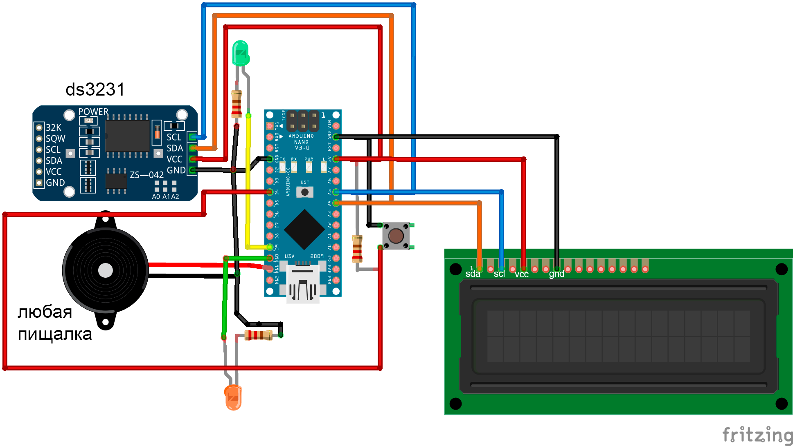

# Dota2Helper
Набор программ на C / Python, позволяющий легко контролировать тайминги респавна рошана / лотусов / торментора
- пока реализован контроль только одного торментора

## описание работы и подготовка системы

### Arduino
По сути можно собрать отдельное устройство на базе Arduino nano с помощью которого можно отслеживать тайминги, но это не очень удобно, ибо тыкать на кнопку устройства во время игры не совсем удобно

Сборка производится по следующей схеме
Резисторы на диодах имеют номинал в ~500 Ом, подтяжка для кнопки - 10КОм

### Управление на Arduino
- 3 клика по кнопке запускает таймер игры, на экран выводится трехминутный отсчет, показывающий тайминги лотусов, также, за 15 секунд до лотуса начинает мигать светодиод, если включен звук - пищалка проиграет мелодию, когда на таймере останется 10 секунд
- 2 клика по кнопке сигнализируют о том, что торментор умер - запускается десятиминутный отсчет, остальное аналогично пункту выше
- 1 клик по кнопке сигнализирует о том, что рошан умер, запускается два таймера: на 11 минут и 8 минут соответсвенно, остальное аналогично первому пункту 
- удержание кнопки переключит флаг, отвечающий за воспроизведение звука, по горящему диоду можно определить включен звук или нет

### Управление с ПК 
! Для управления с пк нужно, чтобы плата питалась через USB вашего компьютера !\
Можно запусть как обычный питоновский скрипт `pc_controller.py`, так и создать exe-файл, которым мы будем пользоваться

Для создания exe-файла достаточно выполнить `pyinstaller spec_file.spec`\
Единственное - перед этим нужно поправить файл `spec_file.spec`, указав там нужные пути

У вас появится несколько директорий, в директории dist будет лежать исполняемый файл, который спокойно запускается при даблклике 

- При нажатии F6 запускается таймер старта игры и лотусов соответсвенно
- При нажатии F7 оповестим ардуинку, что рошан умер
- При нажатии F8 оповестим ардуинку о том, что торментор умер

Закрыть приложение можно будет из трея

## дополнительно
В папке data есть иконка для приложения + модель корпуса для печати 
